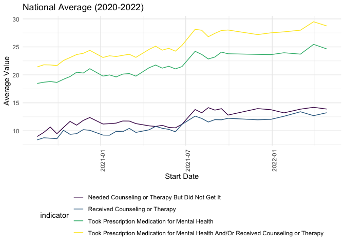

EDA_AR
================
ASHLEY ROMO
2023-11-26

Loading key packages

``` r
library(tidyverse)
```

    ## ── Attaching core tidyverse packages ──────────────────────── tidyverse 2.0.0 ──
    ## ✔ dplyr     1.1.3     ✔ readr     2.1.4
    ## ✔ forcats   1.0.0     ✔ stringr   1.5.0
    ## ✔ ggplot2   3.4.3     ✔ tibble    3.2.1
    ## ✔ lubridate 1.9.2     ✔ tidyr     1.3.0
    ## ✔ purrr     1.0.2     
    ## ── Conflicts ────────────────────────────────────────── tidyverse_conflicts() ──
    ## ✖ dplyr::filter() masks stats::filter()
    ## ✖ dplyr::lag()    masks stats::lag()
    ## ℹ Use the conflicted package (<http://conflicted.r-lib.org/>) to force all conflicts to become errors

Importing clean and tidy dataset

``` r
data = 
  read.csv("data/tidydata.csv")
```

EDA for National Average Per Year

``` r
avg_year =
  data |> 
  filter(state == "United States") |> 
  select(indicator, year, week_number, value) |> 
  group_by(year, indicator, week_number) |> 
  summarize(
    mean = mean(value),
    indicator_total = n()
  )
```

    ## `summarise()` has grouped output by 'year', 'indicator'. You can override using
    ## the `.groups` argument.

``` r
# plot average per year for each indicator
avg_year |> 
  ggplot(aes(x = week_number, y = mean, color = indicator)) +
  geom_point() +
  geom_line() +
  labs(
    x = "Week",
    y = "Average Value",
    color = "Indicator",
    title = "National Average Per Year (2020-2022)",
  ) +
  theme(
    legend.position = "bottom"
  ) +
  facet_grid(~ year)
```

<!-- -->
