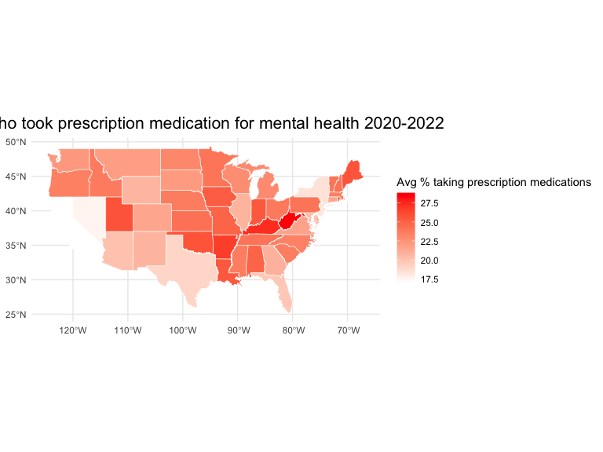

EDA_by_state
================
Caleigh Dwyer
2023-11-26

``` r
library(tidyverse)
```

    ## ── Attaching core tidyverse packages ──────────────────────── tidyverse 2.0.0 ──
    ## ✔ dplyr     1.1.3     ✔ readr     2.1.4
    ## ✔ forcats   1.0.0     ✔ stringr   1.5.0
    ## ✔ ggplot2   3.4.3     ✔ tibble    3.2.1
    ## ✔ lubridate 1.9.2     ✔ tidyr     1.3.0
    ## ✔ purrr     1.0.2     
    ## ── Conflicts ────────────────────────────────────────── tidyverse_conflicts() ──
    ## ✖ dplyr::filter() masks stats::filter()
    ## ✖ dplyr::lag()    masks stats::lag()
    ## ℹ Use the conflicted package (<http://conflicted.r-lib.org/>) to force all conflicts to become errors

``` r
library(sf)
```

    ## Linking to GEOS 3.11.0, GDAL 3.5.3, PROJ 9.1.0; sf_use_s2() is TRUE

``` r
library(maps)
```

    ## 
    ## Attaching package: 'maps'
    ## 
    ## The following object is masked from 'package:purrr':
    ## 
    ##     map

``` r
knitr::opts_chunk$set(
    echo = TRUE,
    warning = FALSE,
    fig.width = 8, 
  fig.height = 6,
  out.width = "90%"
)

theme_set(theme_minimal() + theme(legend.position = "bottom"))

options(
  ggplot2.continuous.colour = "viridis",
  ggplot2.continuous.fill = "viridis"
)

scale_colour_discrete = scale_colour_viridis_d
scale_fill_discrete = scale_fill_viridis_d

##visualizations of US map require install of sf and maps packages
```

import tidy dataset:

``` r
##note: should we export tidy dataset to our directory on github so we can delete this code from any EDA?

rawdata =
  read_csv("data/mental_health.csv")
```

    ## Rows: 10404 Columns: 15
    ## ── Column specification ────────────────────────────────────────────────────────
    ## Delimiter: ","
    ## chr (10): Indicator, Group, State, Subgroup, Phase, Time Period Label, Time ...
    ## dbl  (5): Time Period, Value, LowCI, HighCI, Suppression Flag
    ## 
    ## ℹ Use `spec()` to retrieve the full column specification for this data.
    ## ℹ Specify the column types or set `show_col_types = FALSE` to quiet this message.

``` r
tidydata = 
  rawdata |> 
  janitor::clean_names() |>
  mutate(indicator = str_replace(indicator, ", Last 4 Weeks", "")) |> 
  select(-phase, -quartile_range, -suppression_flag) |> 
  mutate(group = str_replace(group, "By ", "")) |>
  drop_na(value) |>
  select(start_date = time_period_start_date, end_date = time_period_end_date, everything())

tidydata =
  tidydata |>
  mutate(week_number = match(time_period_label, unique(time_period_label))) |>
  mutate(
    start_dates = mdy(pull(tidydata, start_date)),
    end_dates = mdy(pull(tidydata, end_date))) |> 
  mutate(tpl = time_period_label) |>  
  mutate(year = as.numeric(str_extract(tpl, "\\d{4}")))|> 
  separate(col = time_period_label, into = c("week_label", "years"), sep = ", ", remove = FALSE, extra = "merge") |>
  select(indicator, year, start_dates, end_dates, week_number, week_label = time_period_label, state, group, subgroup, value, low_ci, high_ci, confidence_interval)
```

## EDA

This EDA will analyze mental health care access trends by state.

I will first create a dataframe that only includes state-level
observations.

``` r
state_df =
  tidydata |> 
  filter(group == "State")
```

### Indicator 1: Took prescription

Let’s start with the mental health indicator “Took Prescription
Medication for Mental Health”

The following chunk shows the top five states with the highest mean
percentage of respondents who reported taking prescription medication
for mental health from 2020-2022.

``` r
state_meds_top5 =
  state_df |> 
  filter(indicator == "Took Prescription Medication for Mental Health") |> 
  group_by(state) |> 
  summarize(mean_value = mean(value)) |> 
  arrange(desc(mean_value)) |> 
  top_n(5) |> 
  knitr::kable()
```

    ## Selecting by mean_value

Let’s visualize a heat map of this indicator’s prevalence by US state.

First, we’ll merge the filtered dataset with an existing US state map
dataset to assist with mapping.

``` r
state_meds =
  state_df |> 
  filter(indicator == "Took Prescription Medication for Mental Health") |> 
  group_by(state) |> 
  summarize(mean_value = mean(value)) |> 
  mutate(state = tolower(state))

usa = 
  st_as_sf(map("state", fill = TRUE, plot = FALSE))

us_meds =
  merge(usa, state_meds, by.x = "ID", by.y = "state", all.x = TRUE)
```

Next, we’ll plot the data using ggplot

``` r
ggplot(us_meds)+
  geom_sf(aes(fill = mean_value), color = "white", size = 0.2)+
  scale_fill_gradient(low = "white", high = "red", na.value = "grey50", name = "Avg % taking prescription medications")+
  theme_minimal()+
  theme(legend.position = "right",
        plot.title = element_text(hjust= 0.5, size = 16),
        plot.caption = element_text(hjust=0.5, size = 12))+
  labs(title = "% who took prescription medication for mental health 2020-2022")
```



``` r
ggplot(us_meds)+
  geom_sf(aes(fill = mean_value), color = "white", size = 0.2)+
  scale_fill_gradient(low = "white", high = "red", na.value = "grey50", name = "Avg % taking prescription medications")+
  theme_minimal()+
  theme(legend.position = "right",
        plot.title.position = "plot")+
  labs(title = "Average % used prescription medication for mental health 2020-2022, by state")
```


“Average proportion of state residents who took prescription medications
between 2020-2022”

“Took Prescription Medication for Mental Health And/Or Received
Counseling or Therapy”
