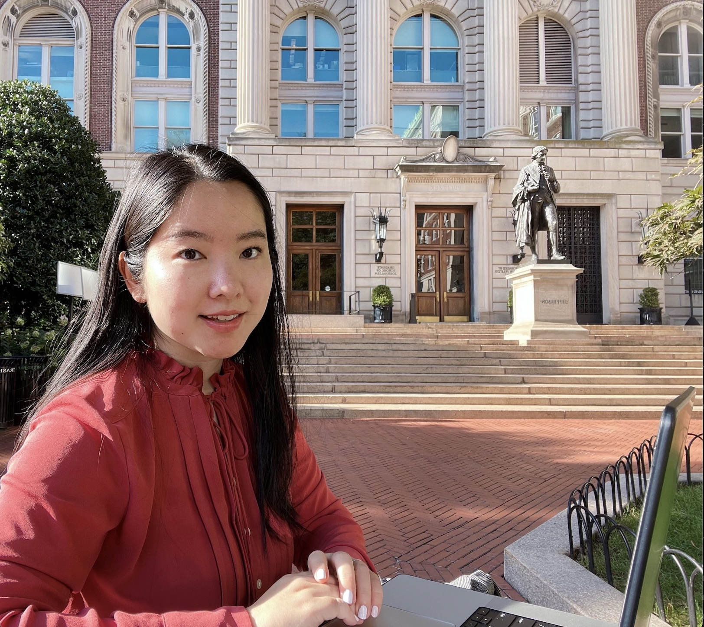

```{r setup, include=FALSE}
knitr::opts_chunk$set(echo = TRUE)
```

### Ashley Romo


Ashley is a second-year MPH candidate in the Department of Epidemiology at Columbia University Mailman School of Public Health. She is pursuing a certificate in Applied Biostatistics and Public Health Data Science.

[LinkedIn](https://www.linkedin.com/in/ashley-romo-963a35129/)

### Caleigh Dwyer


Caleigh is a second-year MPH candidate in the Department of Sociomedical Sciences at Columbia University Mailman School of Public Health. She is pursuing a certificate in Public Health Research Methods.

[LinkedIn](www.linkedin.com/in/caleigh-dwyer-a512a912b)

### Hsin Yi (Cindy) Tseng


Hsin Yi (Cindy) is a second-year MPH candidate in the Department of Epidemiology at Columbia University Mailman School of Public Health. She is pursuing a certificate in Applied Biostatistics and Public Health Data Science.

[LinkedIn](https://www.linkedin.com/in/hsin-yi-t-012b1097?trk=contact-info)

### Sarah Younes


Sarah is a second-year MPH candidate in the Department of Sociomedical Sciences at Columbia University Mailman School of Public Health. She is pursuing a certificate in Public Health Research Methods.

[LinkedIn](https://www.linkedin.com/in/sarahmyounes/)

### Wen Dai



Wen is a second-year MPH candidate in the Department of Epidemiology at Columbia University Mailman School of Public Health. She is pursuing a certificate in Applied Biostatistics and Public Health Data Science.
