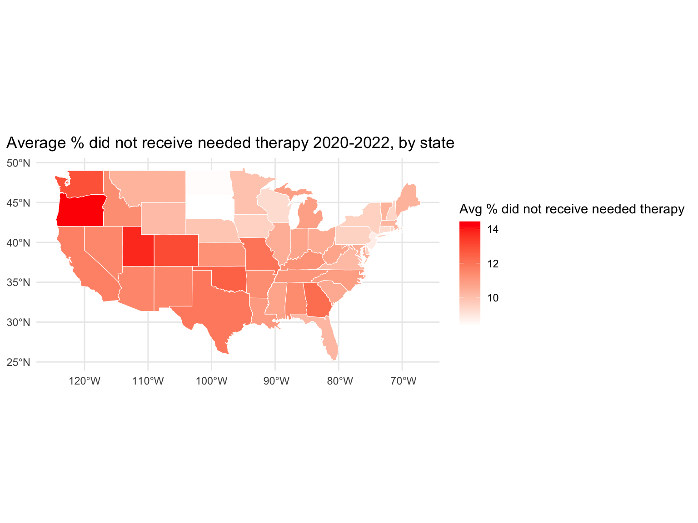

## Motivation


COVID-19 has had serious behavioral and mental health implications. One survey conducted by the Centers for Disease Control and Prevention in July 2020 found that [41%](https://www.cnn.com/2020/08/13/health/mental-health-coronavirus-pandemic-cdc-study-wellness/index.html) of respondents were struggling with mental health issues stemming from the pandemic. Different demographics have worse outcomes, such as [young people](https://www.pewresearch.org/short-reads/2023/03/02/mental-health-and-the-pandemic-what-u-s-surveys-have-found/), and these outcomes are [continuing](https://www.kff.org/mental-health/issue-brief/the-implications-of-covid-19-for-mental-health-and-substance-use/) years after the pandemic first hit.

Our project aimed to explore trends and differences in indicators of mental health care access across the United States from August 2020-May 2022, as well as disaggregate data by state, age group, education level, gender, race/ethnicity, and sexual orientation.

## Related Work

Many of us remember reading articles about the difficulty of accessing therapists and counselors during the rise of the COVID-19 pandemic in spring 2020. Providers reported month-long waiting lists that they have [never seen](https://www.cnn.com/2020/12/18/health/mental-health-care-demand-wellness/index.html) until the pandemic hit in spring 2020.

Yet these trends did not taper off; instead, they continued to worsen. According to the [American Psychological Association](https://www.apa.org/news/press/releases/2021/10/mental-health-treatment-demand), the percent of psychologists who treat anxiety and depression who saw an increase in demand for anxiety or depression treatment increased by 13.5% and 20%, respectively, from 2020 to 2021. The number of psychologists who reported receiving more referrals increased from 37% in 2020 to 62% in 2021. Nearly 7 in 10 psychologists with a waiting list in 2021 reported it had grown longer since the start of the pandemic. Even through March 2022, prospective patients are [still](https://www.washingtonpost.com/health/2022/03/06/therapist-covid-burnout/) struggling to find providers who are accepting new patients or do not have month-long waiting lists.

## Data

### Data Source

We are using the [Mental Health Care in the Last 4 Weeks](https://catalog.data.gov/dataset/mental-health-care-in-the-last-4-weeks) data set. Data was collected as part of the Pulse Household Survey across the United States with the U.S. Census Bureau and numerous other federal agencies. The mental health portion of the survey asks respondents to look back in the last 4 weeks and answer whether they:

* Received counseling or therapy for mental health,
* Took prescription medication for mental health, and
* Needed counseling or therapy but did not get it.

The data set includes an additional indicator that combines those who received counseling or therapy and/or took prescription medication for mental health. The percentage of participants who responded "Yes" were calculated for each of the 3 questions they were asked, as well as the additional indicator. It is  possible that participants respond "No" to each of the 3 questions they are asked, so the values for the 3 questions do not add up to 100%.

Data was collected from a nationally representative sample of approximately [50,000-90,000](https://www.cdc.gov/nchs/covid19/pulse/mental-health-care.htm) participants every two weeks for a total of 38 time periods of data collection.

### Data Cleaning

The data set is available for download in multiple formats on  [catalog.data.gov](https://catalog.data.gov/dataset/mental-health-care-in-the-last-4-weeks), and we downloaded the Comma Separated Values (.csv) file.

The first portion of data cleaning was the data import, which involved downloading and importing the .csv using `read_csv` and saving the raw data set.

The second portion of data cleaning was cleaning columns. This step involved removing unnecessary columns, cleaning and renaming columns for clarity, and dropping missing values.

The third portion of data cleaning was tidying the date formats. This step involved converting dates to the date format using `mdy`, creating a new numeric `year` variable, and cleaning the week numbers and labels.

```{r message = FALSE}
## part 1: importing raw data

library(tidyverse)

rawdata =
  read_csv("data/mental_health.csv")

## part 2: renaming and cleaning columns

tidydata = 
  rawdata |> 
  janitor::clean_names() |>
  dplyr::select(-phase, -quartile_range, -suppression_flag) |>
  dplyr::mutate(
    indicator = str_replace(indicator, ", Last 4 Weeks", ""),
    group = str_replace(group, "By ", "")) |>
  drop_na(value) |>
  dplyr::select(start_date = time_period_start_date, end_date = time_period_end_date, everything())

## part 3: tidying dates

tidydata =
  tidydata |>
  dplyr::mutate(
    week_number = match(time_period_label, unique(time_period_label)),
    start_dates = mdy(pull(tidydata, start_date)),
    end_dates = mdy(pull(tidydata, end_date)),
    tpl = time_period_label,
    year = as.numeric(str_extract(tpl, "\\d{4}"))) |>
  separate(col = time_period_label, into = c("week_label", "years"), sep = ", ", remove = FALSE, extra = "merge") |>
  dplyr::select(indicator, year, start_dates, end_dates, week_number, week_label = time_period_label, state, group, subgroup, value, low_ci, high_ci, confidence_interval)
```

### Final Data Set

The final tidy data set included 13 variables:

* `indicator` (chr): The type of mental health care.
* `year` (num): The year of the time period for data collection.
    * If the time period for data collection continued onto the following year, the year that data collection began was used for this variable.
* `start_dates` (date): The start date of the time period for data collection.
* `end_dates` (date): The end date of the time period for data collection.
* `week_number` (num): The week number of data collection.
    * It should be noted that the data set refers to "weeks" as the two-week data collection period, so each week number indicates a two-week period.
* `week_label` (chr): The dates for the corresponding week.
* `state` (chr): The state or national level data.
* `group` (chr): The demographic group.
* `subgroup` (chr): The specific subgroup within the group.
* `value` (num): The value (percentage or number) representing the indicator.
* `low_ci` (num): Lower bound of the confidence interval of the value.
* `high_ci` (num): Upper bound of the confidence interval of the value.
* `confidence_interval` (chr): Confidence interval as a range.

## Initial Questions

We are interested in identifying trends over time at the national, state, and demographic level. Our initial questions were the following:

* What is the national prevalence over time?
* Are there are the differences among states? Which states have the highest values and which states have the lowest values?
* What is the proportion of services needed but not received by individuals in New York? 
* What is the proportion of services needed but not received by individuals across states?
* Are there differences in indicators of mental health outcomes by demographic characteristic (age, education level, gender, race/ethnicity, and sexual orientation)? Are they statistically significant?
* Can we apply a linear model to the data?

We were able to answer all of these questions through our analyses.

## Exploratory Analysis

We conducted Exploratory Data Analysis (EDA) at the [national-level](EDA_AR.html), [state-level](eda.html), and [demographic-level](eda_demographic.html).

#### National-Level

To look at the prevalence in the United States, we filtered the data set for the United States to focus national data rather then state-specific data. Next, we grouped by year, start date, and indicator to ensure we calculate the mean value for each indicator by start date of data collected. After calculating the mean, we plotted the mean value and start date to showcase the mean national value over time. The plot shows a increase in prevalence between 2020 and 2022 with those who took prescription medication for mental health and/or received counseling or therapy with the highest prevalence and those who received counseling or therapy with the lowest prevalence.

```{r message = FALSE, echo = FALSE}
avg_year =
  tidydata|> 
  dplyr::filter(state == "United States") |> 
  dplyr::select(indicator, year, week_number, value, start_dates) |> 
  group_by(year, start_dates, indicator) |> 
  dplyr::summarize(
    mean = mean(value),
    indicator_total = n())

# plot average for each start date for each indicator
avg_year |> 
  ggplot(aes(x = start_dates, y = mean, color = indicator)) +
  geom_line() +
  labs(
    x = "Date",
    y = "Prevalence",
    title = "National Average (2020-2022)",
    color = "Indicator") +
  theme(
    legend.position = "bottom",
    axis.text.x = element_text(angle=90, hjust=1),
    strip.text = element_text(size = 4)) +
  guides(color = guide_legend(nrow = 4))
```

#### State-level

To look at the prevalence of each indicator of mental health care utilization by state, we filtered the main data set to only include observations at the state-level. For subsequent analyses, we used filter to select only observations for the indicator of interest. Next, we grouped by state to calculate the mean prevalence of each indicator by state, then created a table of the top 5 states by mean prevalence between 2020-2022 for each indicator. Then, we created a heat map showing mean prevalence by state for each indicator between 2020-2022 using the sf and maps packages. Next, we grouped by state and year to calculate the mean prevalence by state and year and then calculate the change in mean prevalence between 2020-2022 by state. Using this data, we created a table of the 5 states with the highest change in mean prevalence between 2020-2022 for each indicator. Lastly, we created an interactive graph for each indicator showing change in mean prevalence for each state over time using plotly. The result is 16 graphs or tables that describe state-level trends in mental health care utilization and access in the United States between 2020-2022.


```{r, echo = FALSE, message = FALSE, warning = FALSE, fig.keep="none"}
library(plotly)

state_df =
  tidydata |> 
  filter(group == "State")

state_df |>
  filter(indicator == "Received Counseling or Therapy") |> 
  group_by(state, year) |>
  summarize(mean_value = mean(value)) |> 
  mutate(year = factor(year)) |> 
plot_ly(x = ~year, y = ~mean_value, color = ~state, type = "scatter", mode = "lines+markers") |>
  layout(
    title = "% received counseling or therapy by state & year",
    xaxis = list(title = "Year"),
    yaxis = list(title = "Average % received therapy"))

```




#### Demographic-Level

To look at the differences in indicators of mental health care access by each of the 5 demographic groups (age group, education level, gender, race/ethnicity, and sexual orientation), we filtered the main data set to only include that demographic group and observations at the national-level. We filtered for the weeks of data collection for one demographic group, sexual orientation, because the Household Pulse Survey only started collecting data on sexual orientation over halfway through data collection. Next, we grouped the indicators by date and demographic group, and re-leveled the demographic groups to show rates from lowest to highest (or from youngest to oldest for age). Then, we created line graphs for each of the 5 demographic groups showing the trends in the 4 indicators of mental health access over time in the United States.

The line graph for sexual orientation shows stark differences between groups.


## Additional Analysis

We conducted [independent samples t-tests and ANOVA](statistical_analysis.html) to determine if there were statistically significant differences in access to mental health for each demographic characteristic.

#### Bivariate Analysis

We conducted bivariate analysis to see if there is a statistical relationship between each demographic characteristic and two of our indicators of mental health access: took prescription medication and/or received counseling or therapy for mental health, and needed counseling or therapy for mental health but did not get it. P-values less than 0.05 were considered as statistically significant.

Since gender is binary, we ran an independent samples t-test. The remaining demographic characteristics (age group, education level, race/ethnicity, and sexual orientation) all have three or more categories, so we ran one-way ANOVA tests within them.

#### Linear Modeling

In an attempt to use a linear model, we used the stepwise function to see if adding the variable, subgroup, was useful in identifying the best linear model for our data set. Upon further analysis, we realized that the stepwise approached was ineffective given that all our predictors are under one variable, subgroup.

We attempted to rearrange the data using the pivot_wider function to isolate each predictor to a distinct variable rather than having all of our predictors under the subgroup variable. However, we came across challenges. First, the data for each predictor has a different value for each week. Second, the number the predictors differed across weeks. Given that our data set is grouped data, we were unable to organize our data set in a way that allowed us to isolated predictors and apply a linear model with each demographic characteristic as a predictor.

## Discussion

#### National-Level

On average, those who took prescription medication for mental health and/or received counseling or therapy had the highest values while those who received counseling or therapy had the lowest values. Evidence suggests that having [more therapy session may improve patient outcomes](https://www.ncbi.nlm.nih.gov/pmc/articles/PMC5550525/). Therefore, those who received counseling or therapy may have a lower prevalence because they may not go to therapy or counseling as often as they would like to due to schedule conflicts or cost.

Overall, each indicator had a increase in prevalence between 2020 and 2022. During the pandemic, services were restricted due to the shelter in place order. Consequently, therapist were forced to have virtual therapy sessions rather than in-person therapy sessions, which resulted in many [challenges](https://www.ncbi.nlm.nih.gov/pmc/articles/PMC8339462/) such as distractions, challenges with emotional connectedness, and privacy concerns. Not only were individuals living through a threatening pandemic, many individuals did not have access to mental health service they had access to before the pandemic. After the pandemic, the nation ended its shut down and services that were halted were resumed. This transition from the shut down may explain why the prevalence was low in 2020 and has increased since then.

#### State-Level 

After analysis of the four indicators by state, we found the lowest prevalence of mental health care use in some of the most populous US states: California, New York, Texas, and Florida. Medication use prevalence was highest in West Virginia, Kentucky, Arkansas, Utah, and Oklahoma. Except for Utah, these states have high rates of [poverty](https://data.ers.usda.gov/reports.aspx?ID=17826) and low [median household income](https://www.kff.org/other/state-indicator/median-annual-income/?activeTab=map&currentTimeframe=0&selectedDistributions=median-annual-household-income&sortModel=%7B%22colId%22:%22Location%22,%22sort%22:%22asc%22%7D), which could drive higher rates of mental health medication use.


Therapy use was highest in District of Columbia, Massachusetts, Rhode Island, Vermont, and Oregon. These states have high levels of [educational attainment](https://data.ers.usda.gov/reports.aspx?ID=17829#P9452d1b2fc324fd3ba7da7fb1edf4e99_2_240iT2) which could mean that their populations have more positive perceptions of therapy. That said, the greatest change in therapy use during the pandemic was in more rural states with lower median household income, like Nebraska and North Dakota. It is possible that these were states that particularly benefited from expansions in telehealth for providing therapy. 
When medication and therapy indicators are combined to indicate overall mental health burden, West Virginia, Utah, and Kentucky remain the highest, but are joined by Vermont and Maine. Vermont, Maine, and Utah all have high median household income, which suggests ruralness rather than income levels may drive mental health burden at the state level.


Interestingly, the states with the highest prevalence of unmet therapy needs also tended to have a higher prevalence of therapy use. This could indicate that demand for therapy outpaced supply of mental health care providers even with the expansion of telehealth during the pandemic. However, West Virginia, which had a high prevalence of medication use, did not have high unmet therapy needs. This could mean that in certain states, medication use is not tied to therapy use.


#### Demographic-Level

_Age:_
Differences in taking prescription medication and/or receiving counseling or therapy for mental health, as well as needing but not receiving counseling or therapy for mental health, were statistically different across age groups. The 18-29 age group has the highest values across all the indicators, especially for the indicator of taking prescription medication for mental health and or receiving counseling. This might be due to the pandemic, where lockdown and transition to a virtual environment cause additional pressure on this age group, and mental health services are needed to relieve the overwhelming burdens. On the other hand, the 60 and above age group has the lowest values of needed counseling or therapy but did not get it and received counseling or therapy. It might be due to stigma around mental health, where there might be low reports of expressing the need for counseling or therapy.

_Education:_
On average, the bachelor's degree or higher group has the highest rates of taking prescription medication for mental health and/or receiving counseling. On the other hand, those who have a lower education levels (high school diploma or GED and less than high school diploma groups) have the lowest rates of needing counseling or therapy but not getting it and received counseling or therapy indicators. Differences in taking prescription medication and/or receiving counseling or therapy for mental health and in needing but not receiving counseling or therapy for mental health were statistically different across education levels.

_Gender:_
Women reported significantly higher rates of taking prescription medication and/or receiving counseling or therapy for mental health than men. Women took more prescription medication for mental health and received more counseling or therapy for mental health than men, and these trends slightly increased each year from 2020 to 2022. Additionally, women reported significantly higher rates of needing but not receiving counseling or therapy for mental health than men. These findings are not surprising given gender norms and expectations for men and the framing of seeking help as a feminine trait.

_Race/ethnicity:_
Differences in taking prescription medication and/or receiving counseling or therapy for mental health, as well as needing but not receiving counseling or therapy for mental health, were statistically different across racial/ethnic groups. Non-Hispanic multiracial group received the most prescription medication and/or counseling or therapy for mental health and needed counseling or therapy for mental health but did not receive it more than any other racial/ethnic group. Their outcomes worsened over time for all indicators. Non-Hispanic Black and Hispanic/Latino groups had very similar outcomes across all four indicators. Non-Hispanic Asians received and needed the least mental health care out of all racial/ethnic groups. Non-Hispanic White group was the most consistent in their outcomes over time.

_Sexual orientation:_
Out of all demographic characteristics, those who identify as bisexual reported the highest rates of taking prescription medication for mental health and/or receiving counseling or therapy, as their rates reached over 50% at some time points in 2021 and 2022. Individuals who identify as bisexual reported the highest trends in all four indicators compared with gay or lesbian and straight Americans, although they were closely followed by individuals who identify as gay or lesbian. Outcomes in mental health access for individuals who identify as bisexual showed the most variation over time. Individuals who identify as straight reported the least unmet need for counseling or therapy, and their outcomes were consistent over time. Differences in taking prescription medication and/or receiving counseling or therapy for mental health and in needing but not receiving counseling or therapy for mental health were statistically different across sexual orientation groups.

## Conclusion

Our findings reflect the increasing demand for therapists and counselors that inspired our work. Nationally, prevalence of both mental health care utilization and unmet mental health care need increased between 2020-2022. These trends were most prominent in rural states. Our demographic analyses revealed the highest demand for mental health services among young adults, those with higher education, women, those who identified as non-Hispanic multiracial, and those who identify as bisexual. Our conclusion is that mental health care services must continue to grow to meet increasing demand since the COVID-19 pandemic. Importantly, the data set we used may not reflect the actual prevalence of mental health disorders, because there are many people who live with undiagnosed disorders (due to lack of access to care or stigma related to receiving care) or who do live with a diagnosis but do not pursue care. This may explain the lower prevalence of mental health care utilization and unmet need among certain groups, such as older adults. Health promotion campaigns may be needed to normalize mental health care utilization and reduce stigma.

In the future, it would be interesting to expand this analysis project to analyze the trend of accessing therapists and counselors post-pandemic. Another potential future analysis will be to compare if there is a difference in individual access to therapists and counselors and if the differences vary by demographic characteristics and levels. Individual-level data would also allow us to perform intersectional analyses that acknowledge the intersection of multiple identities (age, race, gender, etc.) as shaping mental health care experiences.